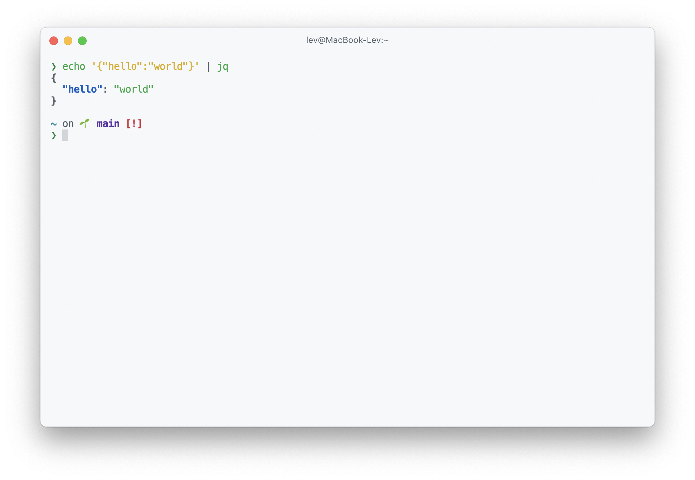
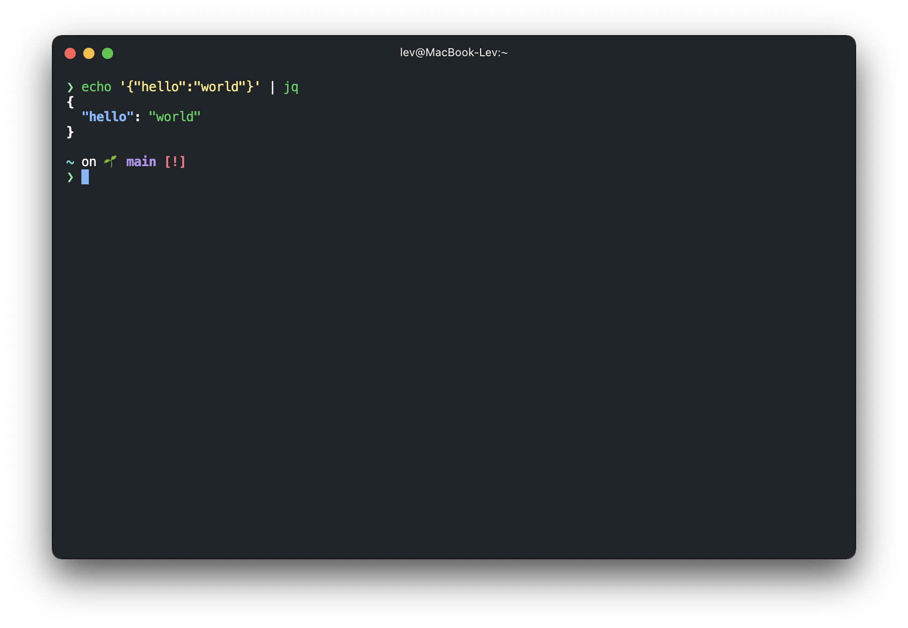

# hyper-vscode-github-auto-theme

    
    

Theme for Hyper terminal that copies colors from [VS Code GitHub theme](https://github.com/primer/github-vscode-theme) and switches light/dark modes automatically.

Inspired by [hyper-theme-switcher](https://www.npmjs.com/package/hyper-theme-switcher).

# Usage

Add `hyper-vscode-github-auto-theme` to plugins in ~/.hyper.js.
